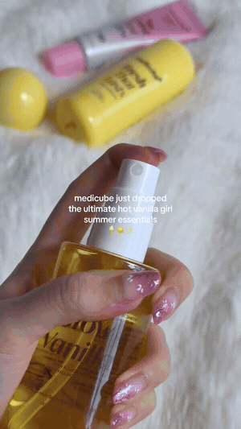
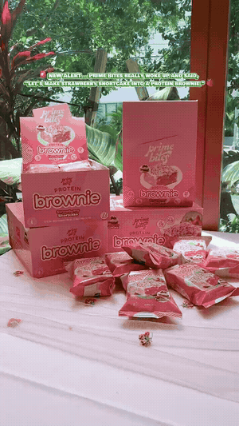
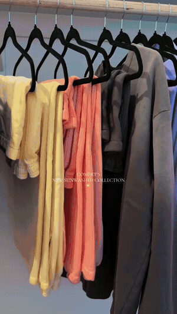

# Content Playbook

First Movers is not a content coaching program. Whether you run top, middle, or bottom of funnel, you already know your style. What this section gives you is a set of proven content formats that work well with brand new product launches, are fast to make, and line up with the speed factor that makes First Movers work. The goal is simple: get content out fast on these launches so you cash in on commissions before anyone else does.

These are just suggestions to help get commissions coming in, especially for newer affiliates who have not honed in on their content yet. Use what fits your account and your workflow.

## Quick Film with On-Screen Text

The simplest format, and it works across every category. A short, clean, aesthetically pleasing clip of the new product with on-screen text that tells the viewer it is new. Something as simple as "omg this is new..." over a nice shot of the product with a trending sound behind it.

Works for beauty, food, health, clothing drops, anything. The point is speed and signaling newness, not production value. You are the first person showing this product, so the "new" angle does the heavy lifting.

<figure><figcaption></figcaption></figure>

<figure><figcaption></figcaption></figure>

<figure><figcaption></figcaption></figure>

## AI Content

You can generate the video of the product with AI. This is one of the fastest methods available and lets you get content out the door without filming anything. For a first mover play where speed is everything, this is one of the strongest options.

<figure><figcaption></figcaption></figure>

## Slideshow Method

If your account has it enabled, you can post a photo slideshow linking the product instead of filming a video. This is quick content that converts, and you do not need the product on hand to make it.

That last part matters. No product needed means you can move immediately on an alert and test far more products than you could if you had to film each one. Only available on some accounts, but if you have it, it is one of the fastest ways to act on a drop.

## In-Store Method

Go to the retailer, film the product in store, post the same day. The buttons on the alerts come in handy here, they point you straight to a store that may have the product so you can get to it fast.

This is the method that pairs directly with Beat the Shipping. No waiting on delivery, film it where it sits on the shelf.

## The Common Thread

Every one of these is built around moving fast. A First Movers alert only pays off if you act on it while the window is open. Pick the method that lets you get content out quickest for your account, and post before the product saturates.
