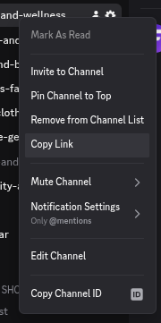

# Notifications

First Movers only works if you actually see the alerts when they fire. It is very important that your notifications are set up properly so you never miss a window.

<figure><figcaption></figcaption></figure>

For every category channel you subscribed to, right-click the channel (or long-press on mobile), select **Notification Settings**, and set it to **All Messages**. Do this for each category you picked, plus [`🔥┃trending-products`](https://discord.com/channels/1440209241192271964/1490144082830430298).

**Be sure to enable push notifications in the Discord mobile app.** Speed is the whole game, and being able to act on an alert as fast as possible is what puts you ahead of other affiliates. Make sure Discord notifications are enabled in your phone system settings, and that the First Movers server is not muted.
